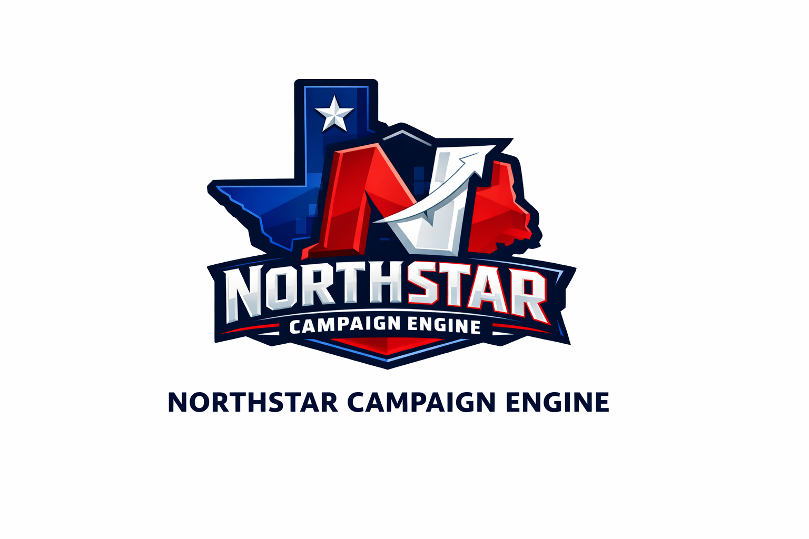

<p align="center">
  
</p>
> *"Navigate by the brightest signal in the data."*

---

# North Star Bank — Audience & Lead Generation (A&LG)
## Business Banking · SAS Campaign Analytics Portfolio

**Simulated Portfolio | End-to-End Campaign & Audience Activation Demo**

---

## Overview

This repository demonstrates a complete **Audience & Lead Generation (A&LG)** workflow for a fictitious financial institution, *North Star Bank* — modeled after the real-world Business Banking campaign and audience strategy at a large regional bank.

The A&LG team sits at the intersection of **marketing science, data engineering, and revenue operations.** Its mandate: build and activate high-precision audience segments, connect marketing activity to revenue, and manage the full lead lifecycle from initial signal through account opening.

### The Evolving A&LG Stack

Modern A&LG operations combine a proven SAS campaign execution foundation with an emerging AI-powered audience science layer:

| Layer | Capability | Tools |
|-------|-----------|-------|
| **Audience Science** | Synthetic audience modeling, AI avatar testing, segment validation | Supernatural AI |
| **Data Activation** | Real-time personalization, online/offline data blending, journey orchestration | Adobe AEP · Real-Time CDP · Journey Optimizer |
| **Campaign Execution** | Lead selection, suppression, QC, multi-channel deployment | SAS (primary) → Azure / Databricks |
| **Attribution** | Closed-loop lead-to-revenue measurement, digitally acquired revenue tracking | PROC SQL · Spark SQL · Power BI |

> This repository focuses on the **SAS Campaign Execution layer** — the operational engine that turns audience strategy into qualified, QC'd, channel-ready lead files. Cloud migration notes are included throughout every program.

---

### Campaign Scenario: `NS_ALG_BIZ_XSELL_2024Q3`

North Star Bank's A&LG team is activating a **small business owner (SBO) cross-sell** campaign — one of the bank's core target audience segments alongside young affluent, midlife affluent, and high-net-worth. The goal: identify personal deposit customers with SBO signals who have not yet opened a business checking account, and reach them at the right moment across the right channel.

| Attribute | Detail |
|-----------|--------|
| **Team** | Audience & Lead Generation (A&LG) |
| **Campaign** | NS_ALG_BIZ_XSELL_2024Q3 |
| **Product** | Business Checking Account |
| **Audience Segment** | Small Business Owners (SBO) · Personal deposit holders · No existing biz acct |
| **Target Age Band** | 35–60 |
| **Channels** | Direct Mail · Email · Outbound Call Center |
| **Suppression** | Opt-outs · Deceased · Regulatory holds · Contact lag ≤ 30 days |
| **Est. Universe** | ~12,000–18,000 qualified leads |
| **KPIs** | Lead-to-open conversion · Cost per acquired account · Attributed revenue |

---

## Repository Structure

```
northstar-bank-alg/
│
├── README.md
│
├── 01_data_discovery.sas               # Source profiling, SBO signal audit, coverage analysis
├── 02_audience_lead_selection.sas      # Eligibility waterfall, anti-join suppression, dedup
├── 03_data_quality_control.sas         # QC suite: critical/warning checks, %ABORT CANCEL
├── 04_channel_assignment.sas           # Propensity scoring, exclusive channel logic, vendor files
├── 05_campaign_delivery_reconciliation.sas  # Count reconciliation, channel file verification, Workfront log
│
├── data/                               # Synthetic CRM + core banking data (auto-generated)
├── output/                             # Channel delivery files (EMAIL, CALL, MAIL)
└── logs/                               # QC run summaries
```

---

## A&LG Skills Demonstrated

### SAS — Current Production Stack

| Technique | Where Used |
|-----------|-----------|
| BASE SAS DATA step | Data generation, conditional logic, signal confidence hierarchy |
| PROC SQL multi-join | Audience selection waterfall, anti-join suppressions, attribution |
| PROC FREQ / MEANS | Data profiling, QC distributions, response rate reporting |
| Parameterized macros | `%CRITICAL_CHECK`, `%WARN_CHECK`, `%PROFILE_TABLE`, `%CHECK_MISSING` |
| `%ABORT CANCEL` | Hard stop on critical QC failure — files cannot deploy |
| PROC EXPORT / ODS | QC reports, channel delivery files, delivery reconciliation summary |

### Cloud-Ready Patterns — Azure / Databricks Migration Path

Each program includes explicit **Cloud Migration Notes** mapping SAS constructs to their Azure/Databricks equivalents.

| SAS Construct | Cloud Equivalent |
|---------------|-----------------|
| `PROC SQL LEFT JOIN ... WHERE IS NULL` | Spark SQL `LEFT ANTI JOIN` · PySpark `left_anti` |
| `%let campaign_id = ...` | Databricks widget · ADF pipeline parameter |
| `libname alg "..."` | `spark.read.format("delta").load("abfss://...")` |
| `PROC EXPORT dbms=csv` | `df.write.csv()` → ADLS Gen2 delivery container |
| `%ABORT CANCEL` | `raise ValueError()` · Great Expectations validation suite |
| Manual propensity in DATA step | Azure ML · Databricks MLflow model output join |

---

## A&LG Campaign Execution Architecture

```
  ┌─────────────────────────────────────────────────────────────────┐
  │              AUDIENCE SCIENCE LAYER  (upstream)                  │
  │  Supernatural AI synthetic audiences  ·  Adobe Real-Time CDP     │
  │  Adobe Journey Optimizer  ·  Adobe Target personalization        │
  └─────────────────────────┬───────────────────────────────────────┘
                             │  Audience definitions + propensity scores
                             ▼
  ┌─────────────────────────────────────────────────────────────────┐
  │           SAS CAMPAIGN EXECUTION LAYER  (this repo)              │
  │                                                                   │
  │  01 Discovery ──► 02 Audience/Lead Select ──► 03 QC Suite        │
  │                                                    │              │
  │  05 Delivery Recon ◄── 04 Channel Assignment ◄─────┘              │
  └─────────────────────────┬───────────────────────────────────────┘
                             │  Count confirmation · Workfront log
                             ▼
  ┌─────────────────────────────────────────────────────────────────┐
  │              CAMPAIGN TRACKING LAYER                              │
  │  Adobe Workfront campaign close  ·  Delivery confirmation memo   │
  └─────────────────────────────────────────────────────────────────┘
```

---

## Running the Code

Programs run **sequentially** (01 → 05). Set `base_path` and run in order.

```sas
%let base_path = /your/path/northstar-bank-alg;
%include "&base_path./01_data_discovery.sas";
/* Continue through 05 */
```

> All data is **fully synthetic** — generated programmatically. No real customer data is used.

---

## Easter Egg 🌟

<details>
<summary>You found the North Star. Click to navigate.</summary>

```
The North Star (Polaris) doesn't move.
Every other star in the sky wheels around it.

In Audience & Lead Generation, your suppression file is Polaris.
It never moves. Build everything else around it.

The analyst who checks suppression last
is the analyst who calls someone they shouldn't.
That is not a data problem.
That is a compliance event.

— North Star Bank A&LG Field Manual, §3.2
    ("The Polaris Principle")
```

*P.S. If you found this before your interview, you do the kind of thorough,
detail-oriented research that A&LG needs. That's the job.*

</details>

---

## About This Portfolio

Built to demonstrate A&LG-aligned campaign execution expertise: multi-source audience data integration, SBO signal confidence hierarchy, lead selection waterfall, QC discipline with zero-tolerance suppression checks, multi-channel file delivery, and post-deployment reconciliation. The focus is clean, accurate, on-time campaign execution — the operational SAS layer that activates audience strategy into deployable lead files.

*North Star Bank is a fictional entity created for portfolio demonstration purposes only.*
